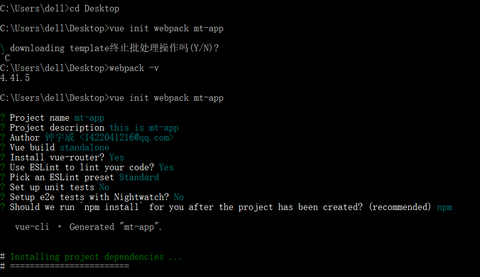
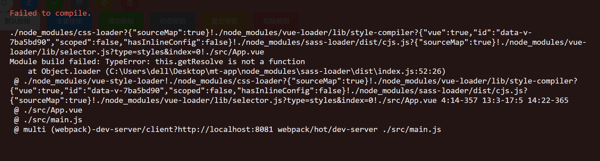

## 美团app

学习美团之前学了vue，element-ui 但是之前学的vue版本都是超过了**2.0**以上的，但是**美团app**需要用**2.0**之内的版本，所以需要将vue之前的版本删掉

### 下载vue2.多的版本。

1. 删版本
> npm uninstall -g vue

2. 下载vue**2.0**之内的版本
> npm install -g vue-cli

下载vue时不要直接写`npm install -g vue`这样下载不成功，尝试过了。就按上面下载就好了。

现在vue-cli版本已经好高了。下载高版本的好像是`npm install -g @vue/cli`下载的。


### 搭建mt-app项目

;

则！这个项目就创建好了。


### 引入Element-ui
然后下载element-ui
> npm install element-ui -S

然后执行`npm run dev`会报错，提示警告。

如：
```
You may use special comments to disable some warnings.
Use // eslint-disable-next-line to ignore the next line.
Use /* eslint-disable */ to ignore all warnings in a file.
```

解决办法就是找到webpack.base.conf.js文件找到
`...(config.dev.useEslint ? [createLintingRule()] : [])`删掉就好了

我们用Element-ui时候会给我们代码规范警告，则需改lint
```js
 "scripts": {
    "serve": "vue-cli-service serve",
    "build": "vue-cli-service build",
    "lint": "vue-cli-service --fix lint"
  },
```

### 现在我们需要下载别的依赖包，因为我们要使用sass预处理

首先下载依赖
> npm install sass-loader style-loader node-sass --saver-dev

但是报错

我就卡在这里很久，明明下载了为什么还是报错你，最后得知，`sass-loader` 包是要依赖`node-sass的。`

最后经过一番折腾
`node-sass@4.13.1`版本
`sass-loader@8.0.2`版本
然后版本不对也不行的。
最后下载了
`sass-loader@7.3.1`版本的才解决了这个问题

这个问题应该是依赖包没更新向后兼容吧。

但是别忘了配置webpack.base.conf.js
```js
 {
        test : /\.scss$/,
        use : ['style-loader','css-loader','sass-loader']
},
```


**vue美团项目使用和element-ui使用有点差异**不是技术上的差异而是用法上不同。element-ui是没创建一个标签都是在`目录>src>文件名`然后弄个入口文件全局注册组件。`目录>index.js`使用install方法全局注册组件。我们在全局上用的时候,如：`Vue.use(ELRow)`则会运行响应的install方法，从而实现全局注册。

而美团项目则是创建组件的时候要用到的地方才注册。就如header文件中需要使用`<top-bar />`,则此时就需要添加进组件来了，如
```js
import TopBar from "./...";
export default {
        components : {
          TopBar;
        }
}
```

**页面重定向 rediect**

在路由中设置重定向

```  routes: [
    {
      path: '/',
      name: 'defaultPage',
      component: defaultPage,
      redirect : "/index",
      children : [{
        path : "/index",
        name : 'index',
        component : Index
      }]
    },
  ]
  ```

**设置金额**

设置金额的时候图标和字体离了太远，则学了一个新属性
`letter-spacing:-3.5px`
让字体缩进

**设置文字不被选中状态**

`user-select:none`

**动态添加class类名**
```html
元素中书写
 <span 
  v-for="(o,i) in item" 
  :key="o + '_' + i" 
  :data-type='o'
  :class="{active : isActive === o}"
   >
       {{ o }}
  </span>
```
```js
    data (){
        return {
            isActive : false
        }
    },
    methods : {
        changecity(e){
            const dom = e.target;
            const resule = dom.tagName.toLowerCase();
            if(resule !== "span"){
                return false;
            }
            this.isActive = dom.getAttribute("data-type");
        }                  
    },
```

**在全局注册自定义组件,切换城市用到！点击事件**
```js
Vue.directive("document-click",{
  // el为元素本身, bindings为绑定的数据, vnode虚拟dom。
  // 执行一次，绑定到元素的时候调用
  bind(el, binding , vnode){
    console.log(el,binding, vnode)
  },
  // 被绑定元素插入父节点时调用
  inserted(el, binding , vnode){
    console.log(el,binding, vnode);
  }
})
```

**然后我们吧select放在父级来控制是否显示，则我们给父级自定义事件，然后子级select调用它，使用自定义事件的时候名字必须是小写。**
`@change_active="changeActive"`

**远程搜索**
```
filterable  是否过滤
remote   是否远程
reserve-keyword
placeholder="请输入关键词"
:remote-method="remoteMethod"  输入的时候会进行远程搜索
:loading="loading"  是否加载中
```


**子集想修改父级传递的数据**

想修改父级传递的数据直接改就不可以的。

可以利用父级中传递一个方法给子级，让子级使用是个方法$emit();

也可以在子级中创建一个变量，用计算属性给这个变量每次读取的时候都重新复值，我就是这样的。select中用到。

**在产品列表里面，搜索传递的参数，以及传递**

我们需要再路由中配置
`
  {
      path : 's/:name',
      name : "goods",
      component : goodsList
  }
`

其中`path : 's/:name'` ,:name是对应路由传递过来的值。然后在url地址显示 

如：```  <router-link :to="{name : 'goods', params: {name: item}}">{{ item }}</router-link>```

**我们使用vuex来存储地理位置信息，以及方便给产品列表共用信息**

写在store.js文件里面。

我们还可以利用`{{ $route.params.name }}`获取输入框的内容
.png)


**使用ajax请求**
> npm install axios --save 

使用
```js
    axios.get("http://api.duyiedu.com/api/meituan/header/searchHotWords.json",{
      params : {
        appkey : '15728238198_1569593310259'
      }
    }).then(rem => {
      this.suggest = rem.data.data;
      this.rmlist = rem.data.data;
    });
```

封装
```js
const axios = require('axios');
axios.defaults.baseURL = 'http://api.duyiedu.com';
axios.interceptors.request.use(function (config) {
    // Do something before request is sent
    config.params = {
        ...config.params,
        appkey : '15728238198_1569593310259'
    }
    return config;
  }, function (error) {
    // Do something with request error
    return Promise.reject(error);
});
```

**在选择城市中遇到的问题**

在选择城市时，省份和城市是有关系的，省份决定了有多少个城市，所以城市时在每个省份下面的，所以遍历省份的时候需要吧参数留下，以便点击的时候知道是哪个省份下面的城市。

可以用自定义的方法来告知父元素省份下的城市。

更改store中的值
```js
// 城市列表传递的数据
    changeCity(item) {
      this.$store.dispatch("setPosition",item.name);  //更改至
      this.$router.push({name : "index"}) // 页面跳转
    },
```


**我们如果需要打包成单个文件，然后发在GitHub上则需配置**

vue.config.js文件
```js
module.exports = {
  publicPath: "./",
  outputDir: "dist",
  lintOnSave: true,
  runtimeCompiler: true
};

```

则我们执行npm run build打包的时候，打包出来的则是空白页面，则需要配置一下路由
```js
const router = new VueRouter({
  mode: "hash",  // mode: "history",  histor每次都刷新页面， hash是解决build包出现的问题。
  base: process.env.BASE_URL,
  routes
});
```

则就打包完成。